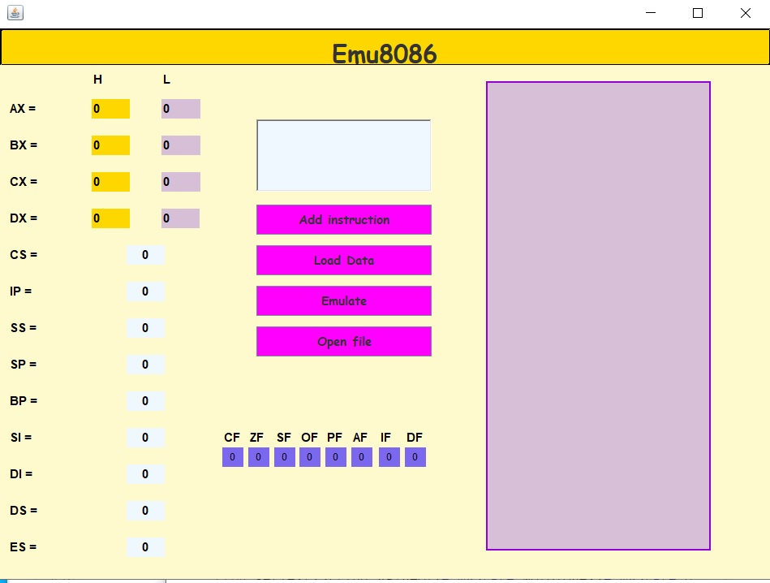
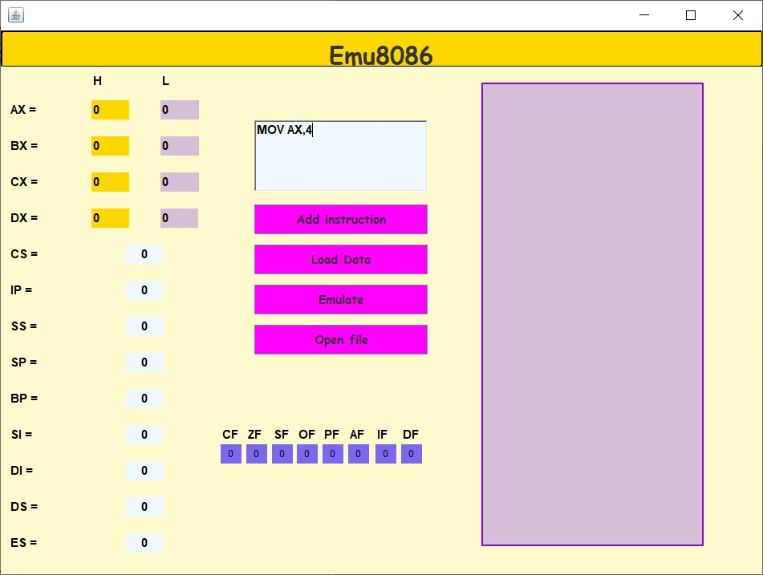
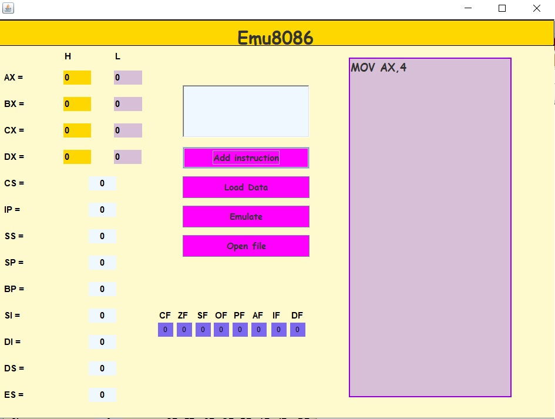
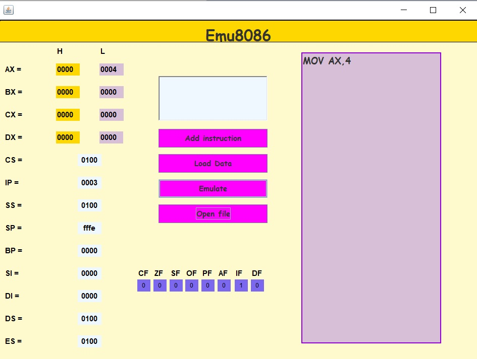
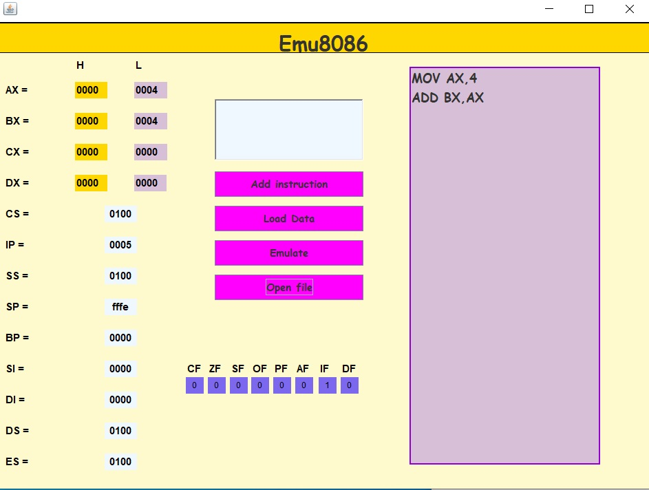
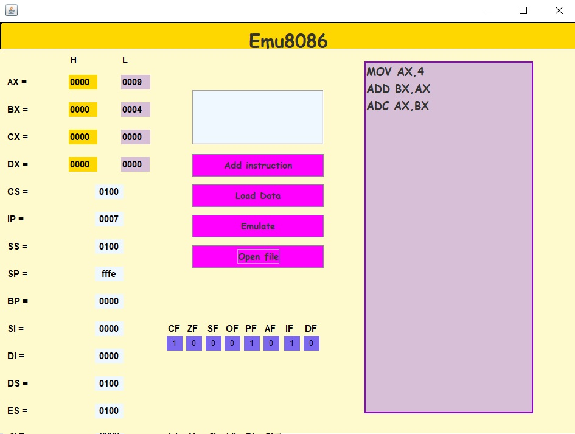
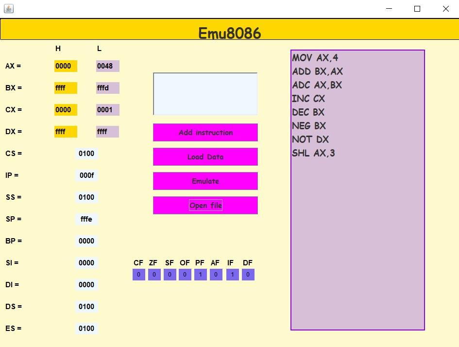
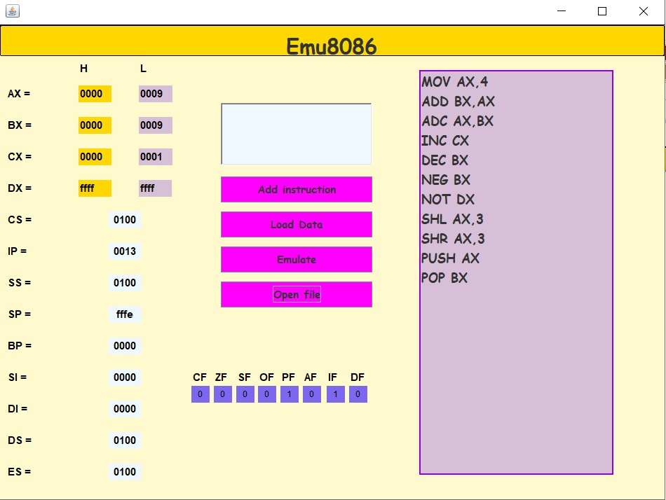
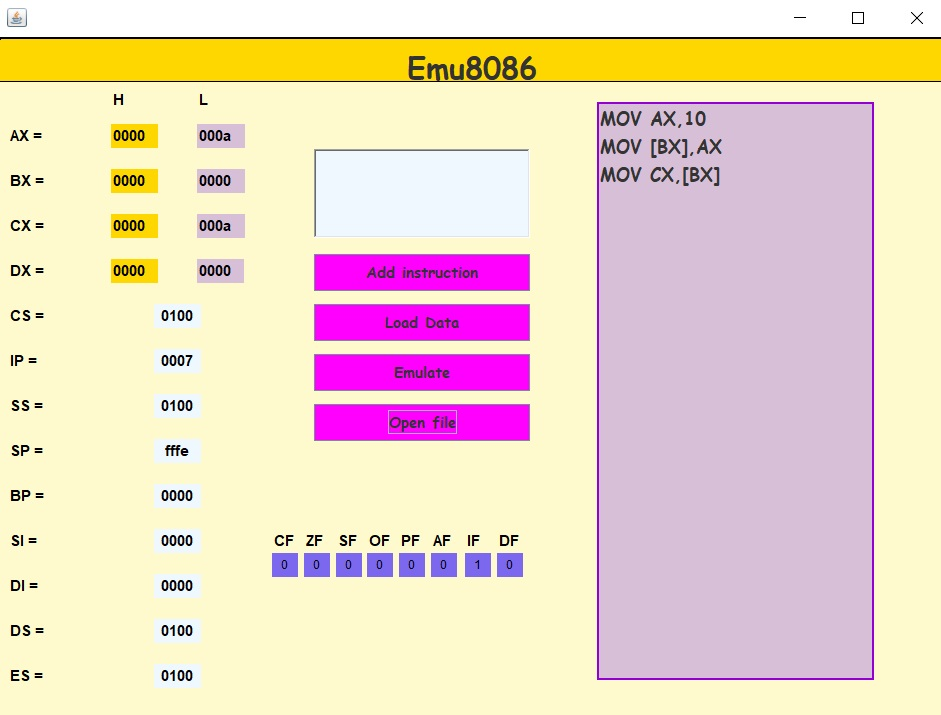

# **Echipa:** Alexandrescu Anda Cristiana 334AB, Chihaia Ramona 332AB
# **Clona Emu8086**

## **Functii implementate** 

- implementare _registrii generali, registrii de segment, registrii pentru memorie, registrii de flag-uri_;
- implementare set de instructiuni: _ADD_; _ADC_; _MOV_; _INC_; _DEC_; _NOT_; _NEG_; _SHL_; _SHR_; _PUSH_;_POP_
- implementare moduri de adresare:
    - _adresare imediata_;
    - _adresare directa_;
    - _adresare indirecta_;
    - _adresare indirecta la registrii_;
    - _adresare bazata indexata_;
    - _adresare bazata_;
- implementare interfata grafica;

 

## **Design si implementare**

 

Primul pas in elaborarea proiectului a reprezentat deciderea limbajului de programare in care proiectul a fost realizat. Cum pe internet se intalnesc cu precadere o serie de proiecte care au ca scop realizarea unei clone EMU8086 in javascript, python sau ruby; am decis sa venim cu o noua metoda de implementare: Java.

Odata stabilit limbajul de programare, am intrat in detalii tehnice: _crearea registrelor_ reprezentative pentru arhitectura 8086. Astfel, in clasa State.java am definit o serie de constante organizate in vectori( vector pentru registrii generali, respectiv registrii de segment) ce reprezinta registrii, dar si flag-urile disponibile in EMU8086. Odata terminata aceasta etapa, am definit in clasa Memory.java_memoria ce va fi alocata sistemului imaginat, in care se pot stoca atat valori pe 8 biti(byte) sau pe 16 biti(word).

O etapa cruciala, a fost reprezentata de modul de codificare al instructiunilor introduce de utilizator in program. Aceasta codificare se realizeaza in clasa Encode.java si se bazeaza pe concepte studiate la Arhitectura Calculatoarelor, adaptate la sistemul actual. Pentru a fi executate, instructiunile sunt impartite prin opcod-uri si moduri de adresare specifice. De asemenea, pentru fiecare instructiune s-a realizat setarea flag-urilor aferente.

In cele din urma, am realizat iterfata grafica prin intermediul elementelor puse la dispozitie de Java Swing. Aceasta prezinta 4 butoane; parte de vizualizare a continutului registrilor, flag-uri si 2 chenare pentru introducerea instructiunilor si vizualizarea lor. Odata introduse instructiunile, acestea vor fi scrise intr-un fisier list.txt de unde vor fi citite de programul realizat pentru a fi prelucrate.

Scurta vizualizare a proiectului:

 

 
In figura din dreapta s-a introdus de la tastatura instructiunea MOV AX, 4. Pentru a o incarca in coada de executie, vom apasa butonul Add Instruction, care va trimite instructiunea in panoul din stanga. Dupa aceasta, se vor apasa pe rand, butonul Load Data care va scrie instructiunea in fisierul pe care il prelucreaza programul si Emulate pentru a realiza instructiunea scrisa.

Rezultatul emularii este vizibil in poza din dreapta, unde observam ca in partea low a registrului AX s-a adaugat valoarea 4. Butonul Open File ne permite permanent sa vizualizam ce instructiuni am introdus.

Rezultatele emularii instructiunilor ADC si ADD sub forma unor instructiuni care au ca operanzi registrii generali.

Rezultatele emularii instructiunilor INC si DEC, instructiuni cu un operand.

Rezultatele emularii instructiunilor NEG si NOT, instructiuni cu un operand.

Rezultatele emularii instructiunilor SHL si SHR, instructiuni cu un operand imediat.

Rezultatele emularii instructiunilor PUSH, POP si al instructiunilor care acceseaza memoria.

La momentul actual, este posibila emularea urmatoarelor sabloane de instructiuni:
- ADD AX/BX/CX/DX , AX,BX/CX/DX;
- ADD AX/BX/CX/DX , [BX]/[BP]/[DI]/[SI]/etc;
- ADD [BX]/[CP]/[DI]/[SI]/[BX+SI]/etc , AX/BX/CX/DX;
- ADD AX/BX/CX/DX,opImd;
- ADD [mem],opImd;

- ADC AX/BX/CX/DX , AX,BX/CX/DX; + flaguri
- ADC AX/BX/CX/DX , [BX]/[BP]/[DI]/[SI]/etc; +flaguri
- ADC [BX]/[CP]/[DI]/[SI]/[BX+SI]/etc , AX/BX/CX/DX;+flaguri
- ADC AX/CX/DX/BX,opImd; + flaguri
- ADC [mem],opImd; +flaguri

- MOV AX/BX/CX/DX , AX/BX/CX/DX
- MOV AX/BX/CX/DX , [BX]/[BP]/[DI]/[SI]/etc;
- MOV [BX]/[CP]/[DI]/[SI]/[BX+SI]/etc , AX/BX/CX/DX;
- MOV AX/BX/CX/DX,opImd;
- MOV [mem],opImd;

- INC AX/BX/CX/DX/SP/BP/SI/DI/[mem];
- DEC AX/BX/CX/DX/SP/BP/SI/DI/[mem];
- NEG AX/BX/CX/DX/SP/BP/SI/DI/[mem];
- NOT AX/BX/CX/DX/SP/BP/SI/DI/[mem];

- SHL AX/BX/CX/DX/SP/BP/SI/DI/[mem];
- SHR AX/BX/CX/DX/SP/BP/SI/DI/[mem];

- PUSH AX/BX/CX/DX/SP/BP/SI/DI/ES/[mem];
- POP AX/BX/CX/DX/SP/BP/SI/DI/ES/[mem];

 

## **Dificultati intampinate**

 

Acest proiect a venit ca o mare provocare in ceea ce a insemnat intelegrea arhitecturii interne. O lunga perioada am petrecut-o numai documentandu-ne despre modul de accesare al registrilor si functionalitatile lor, analizarea modului in care IP se incrementeaza in functie de instructiunea introdusa, metodelor de access la memoriei, scrierea si citirea din aceasta si multe alte detalii tehnice, pe care am reusit sa le depasim datorita surselor de informare regasite pe internet.

De asemenea, transpunerea unor notiuni abstracte referitoare la memorie, intr-un limbaj care prin structura sa duce cu gandul la abstractizare, a fost un pas dificil la inceput, peste care am trecut cu usurinta odata ce am conturat scheletul proiectului.

 

## **Instalarea si rularea aplicatiei**
 

### **Clonare cu SSH**

    git clone git@gitlab.com:smp2021/334ab/clona-emu8086.git

### **Clonare cu HTTP**
    git clone https://gitlab.com/smp2021/334ab/clona-emu8086.git

Se deschide proiectul in Eclipse si se apasa Run in clasa WriteRead.java.

## **Planuri de dezvoltare pentru viitor**
 

In viitor planuim sa extindem aplicatia pentru:

- a trata cazurile in care se introduce o instructiune care nu este suportata de versiunea curenta de clona EMU8086;

- a extinde setul de instructiuni;

- a implementa modul de setare a flag-urilor de catre utilizator; 

- a implementa vizualizarea memoriei;

- extindere la arhitectura pe 64 biti;

 

## **Proiecte similare disponibile pe internet:**
- [Implementare Emu8086 in python](https://github.com/ZubinGou/8086-emulator)
- [x86 PC emulator](https://github.com/ianopolous/JPC) 
- [Implementare Emu8086 in javascript](https://github.com/WindProphet/emu8086) 

## **Surse de informare**
- [Documentatie Emu8086](https://www.philadelphia.edu.jo/academics/qhamarsheh/uploads/emu8086.pdf)
- [Set instructiuni 8086](https://www.gabrielececchetti.it/Teaching/CalcolatoriElettronici/Docs/i8086_instruction_set.pdf)
- [Moduri de adresare disponibile in 8086](https://www.tutorialspoint.com/microprocessor/microprocessor_8086_addressing_modes.htm)
- [Moduri de adresare disponibile in 8086](https://www.tutorialspoint.com/microprocessor/microprocessor_8086_addressing_modes.htm)
- [Codificare instructiuni](http://www.c-jump.com/CIS77/CPU/x86/lecture.html)

